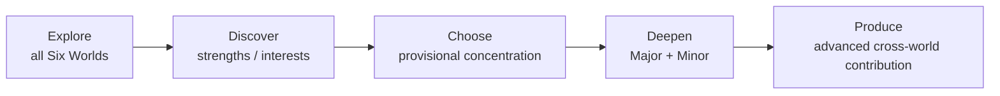

# Six Worlds & Pathways

<a href="/six-worlds">← Stakeholder presentation: Six Worlds</a>

  <strong>APPROVED Core — Six Worlds architecture</strong> 
  Worlds are named in the Concept Constitution. ADR-0011 capability frames and progressive depth are APPROVED (GAP-008 Closed). ADR-0017 Discover meaningful-exposure package APPROVED (GAP-045 Closed). ADR-0018 Discover→Choose pathway preparation APPROVED (GAP-046 Closed). Competency Graph schema remains open (GAP-009). Mission World-tagging significance remains open (GAP-047).

::: tip Portal notice
Source Markdown documents remain authoritative. This page explains the model in plain language and does **not** duplicate the full ADR. Examples are illustrative only.
:::

## Pathway arc

Worlds organise **capability and mission context**. They are **not** six permanent career tracks, school houses or subject lists in disguise.

## The Six Worlds (equal architectural dignity)

::: warning Illustrative — not a curriculum catalogue
Mission and output examples are for architecture communication only.
:::

  <h3>Engineering & Intelligent Systems</h3>
  
<strong>Explores:</strong> designing, modelling, building and governing working systems — including computing, AI, robotics and fabrication as capability contexts, not gadget lists.

  
<strong>Example Missions:</strong> assistive-device prototype; sensing system under safety constraints.

  
<strong>Advanced outputs:</strong> tested prototypes, control systems, software artefacts, responsible-tech evaluations.

  <h3>Health & Life Sciences</h3>
  
<strong>Explores:</strong> living systems, wellbeing and health knowledge through investigation and communication.

  
<strong>Example Missions:</strong> public-health analysis; health-communication design (non-clinical).

  
<strong>Advanced outputs:</strong> research studies, simulations, health-system improvement proposals.

  
<em>Boundary: students are not unlicensed clinicians.</em>

  <h3>Enterprise & Economics</h3>
  
<strong>Explores:</strong> how value is created, organised and exchanged — including social enterprise, not startups only.

  
<strong>Example Missions:</strong> needs research; viable social-enterprise model with ethics review.

  
<strong>Advanced outputs:</strong> venture/operations models, market analyses, responsible-commerce plans.

  <h3>Earth, Energy & Built Environment</h3>
  
<strong>Explores:</strong> environmental systems, energy, materials, infrastructure and place-making.

  
<strong>Example Missions:</strong> water/energy study; urban resilience or land-use analysis.

  
<strong>Advanced outputs:</strong> designs, resilience plans, environmental assessments.

  <h3>Creative, Media & Human Communication</h3>
  
<strong>Explores:</strong> interpretation, craft and audience-facing communication with intellectual seriousness.

  
<strong>Example Missions:</strong> documentary; design for a real audience under consent rules.

  
<strong>Advanced outputs:</strong> films, writing, design systems, journalism, performances, campaigns.

  <h3>Society, Leadership & Public Systems</h3>
  
<strong>Explores:</strong> institutions, governance, civic analysis and public problem-solving — without indoctrination.

  
<strong>Example Missions:</strong> evidence-based civic intervention; public-service policy brief.

  
<strong>Advanced outputs:</strong> policy papers, civic analyses, community interventions.

## Depth without confusing stages

Developmental stages and capability depth are related but **not identical**.

| Capability depth | Meaning |
|---|---|
| Encounter | Recognise the domain |
| Inquire | Guided inquiry / making |
| Apply | Bounded problem application |
| Integrate | Combine capabilities; rising complexity |
| Advance | Substantial independence; authentic standards |
| Contribute | Defensible advanced output |

A Choose-stage learner may already be advanced in one World. A Deepen-stage learner may still be building a prerequisite in another.

## Cross-World Missions

Real problems often span Worlds. A pollution Mission might combine sensing (Engineering), health impact (Health), environmental systems (Earth), implementation economics (Enterprise), public communication (Creative) and policy (Society) — without forcing six separate classes.

## Full decision record

| Artefact | Status | Link |
|---|---|---|
| Six Worlds Capability / Progressive Depth | APPROVED | [ADR-0011](/decisions/adr-0011) |
| Discover Meaningful Exposure Package | APPROVED | [ADR-0017](/decisions/adr-0017) |
| Discover→Choose Pathway Preparation | APPROVED | [ADR-0018](/decisions/adr-0018) |
| Six Worlds + Major/Minor anticipation | APPROVED (high level) | [Concept Constitution](/foundation/concept-constitution) |
| Student development / progressive specialisation | APPROVED | [ADR-0004](/decisions/adr-0004) |
| Formal Major+Minor entry at Deepen | APPROVED | [ADR-0005](/decisions/adr-0005) |
| Pathway mobility / bridging principles | APPROVED | [ADR-0006](/decisions/adr-0006) |
| Mission Ecosystem / authenticity | APPROVED | [ADR-0007](/decisions/adr-0007) |
| Proof of Capability (individual evidence) | APPROVED | [ADR-0016](/decisions/adr-0016) |
| Section shell | DRAFT | `docs/03-worlds-and-pathways/SECTION_README.md` |

## Related gaps

- [GAP-008](/gaps#gap-008) — Six Worlds maps (**Closed** via ADR-0011)
- [GAP-009](/gaps#gap-009) — Competency Graph specification (remains open)
- [GAP-045](/gaps#gap-045) — Discover meaningful-exposure package (**Closed** via ADR-0017)
- [GAP-046](/gaps#gap-046) — Discover→Choose pathway preparation (**Closed** via ADR-0018)
- [GAP-047](/gaps#gap-047) — Mission World-tagging significance thresholds
- [GAP-004](/gaps#gap-004) — Major + Minor introduction timing (**Closed** via ADR-0005)
- [GAP-020](/gaps#gap-020) — Pathway change bridging (**Closed** via ADR-0006)
