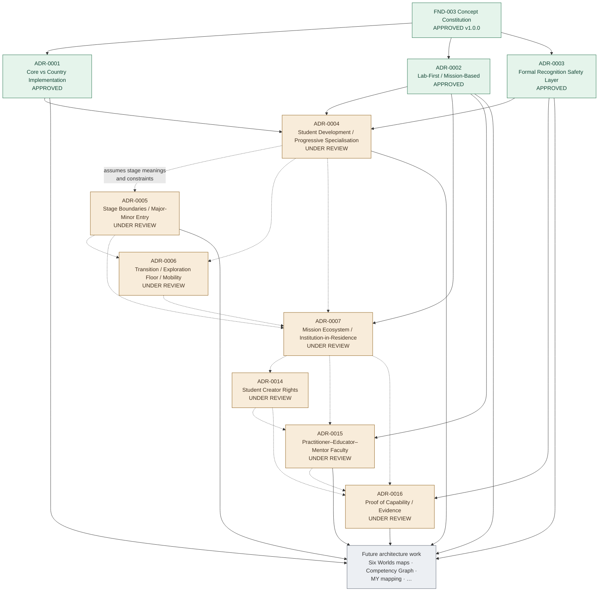

::: tip Portal notice
This portal is a human-readable view of the Tarbiyat architecture repository. Source Markdown documents and approved architectural decisions remain authoritative.
:::

# Architecture roadmap

Relationships below follow documented dependencies — not a claim that every ADR is strictly sequential.

## Decision dependency map

## How to read this

| Link | Meaning |
|---|---|
| Solid arrows into ADR-0001–0003 | Founding ADRs depend on the Concept Constitution and ratify Core architecture |
| Solid arrows into ADR-0004 | Student-development architecture depends on APPROVED FND-003 and ADR-0001–0003 |
| Solid arrow ADR-0003 → ADR-0016 | Proof of Capability elaborates the APPROVED parallel capability layer |
| Dashed arrows among UNDER REVIEW ADRs | Later drafts assume earlier under-review constraints; if a dependency changes before approval, dependents must be re-checked |
| Future work | Not yet decided as ADRs; includes proposed ADR-0008–0013 and open GAPs |

## Chronology vs dependency

Ratification order was roughly: Constitution + ADR-0001/0002/0003 → ADR-0004…0007 / 0014 / 0015 / 0016 drafts.  
ADR-0001, ADR-0002 and ADR-0003 are **sibling founding decisions** under the Constitution, not a strict 0001→0002→0003 dependency chain.

## Open next design areas (from repository evidence)

- Complete human review of [ADR-0004](/decisions/adr-0004)–[ADR-0007](/decisions/adr-0007), [ADR-0014](/decisions/adr-0014)–[ADR-0016](/decisions/adr-0016)
- [GAP-008](/gaps#gap-008) Six Worlds competency maps (proposed ADR-0011)
- [GAP-009](/gaps#gap-009) Competency Graph schema (kept distinct from PoC)
- [GAP-010](/gaps#gap-010) / [GAP-038](/gaps#gap-038)–[GAP-044](/gaps#gap-044) PoC operating follow-ons
- [GAP-032](/gaps#gap-032)–[GAP-037](/gaps#gap-037) Faculty staffing evidence and country role mapping
- [GAP-002](/gaps#gap-002) Malaysia recognition/exam mapping
- Malaysia profile research gaps ([GAP-001](/gaps#gap-001), [GAP-005](/gaps#gap-005)–[GAP-007](/gaps#gap-007), [GAP-014](/gaps#gap-014))

See also: [Project progress](/progress) · [ADR index](/decisions/) · [Gap register](/gaps) · [Proof of Capability](/areas/competency-assessment) · [People & Culture](/areas/people-and-culture)
