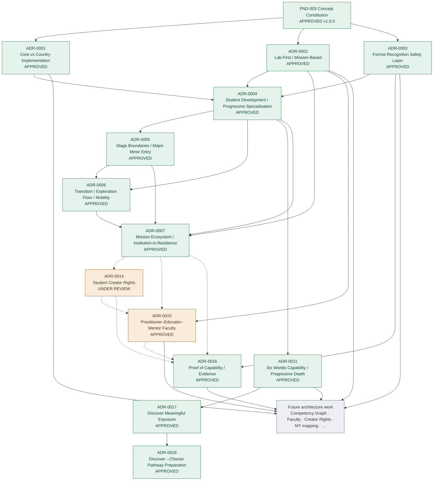

::: tip Portal notice
This portal is a human-readable view of the Tarbiyat architecture repository. Source Markdown documents and approved architectural decisions remain authoritative.
:::

# Architecture roadmap

Relationships below follow documented dependencies — not a claim that every ADR is strictly sequential.

## Decision dependency map

## How to read this

| Link | Meaning |
|---|---|
| Solid arrows into ADR-0001–0003 | Founding ADRs depend on the Concept Constitution and ratify Core architecture |
| Solid arrows into ADR-0004–0007 / 0011 / 0017 / 0018 | Developmental / Worlds / pathway / Mission cluster APPROVED |
| Solid arrow ADR-0003 → ADR-0016 | Proof of Capability elaborates the APPROVED parallel capability layer |
| Dashed arrows into UNDER REVIEW ADRs | Later drafts assume earlier constraints; if a dependency changes before approval, dependents must be re-checked |
| Future work | Not yet decided as ADRs; includes proposed ADR-0008–0013 and open GAPs |

## Chronology vs dependency

Ratification order was roughly: Constitution + ADR-0001/0002/0003 → developmental/Worlds drafts → PoC / learning-time / campus approvals → Integrated Developmental Architecture approvals → ADR-0007 Mission Ecosystem approval (2026-09-17) → ADR-0015 Faculty Architecture approval (2026-09-19).  
ADR-0001, ADR-0002 and ADR-0003 are **sibling founding decisions** under the Constitution, not a strict 0001→0002→0003 dependency chain.

## Open next design areas (from repository evidence)

- Complete human review of [ADR-0014](/decisions/adr-0014) (Creator Rights); ADR-0015 APPROVED — PEO-001–005 / GAP-032–037 remain open
- [GAP-022](/gaps#gap-022) → [GAP-023](/gaps#gap-023) → [GAP-024](/gaps#gap-024): [MIS-001](/areas/mission-partner-governance) → [MIS-002](/areas/institution-in-residence) → [MIS-003](/areas/mission-risk-and-safeguarding) (all DRAFT proposed resolutions — not closed); [Mission Operating Templates](/areas/mission-operating-templates) propose [GAP-031](/gaps#gap-031) resolution — not closed
- [GAP-008](/gaps#gap-008) Closed by [ADR-0011](/decisions/adr-0011) APPROVED; curricula / Graph follow-ons remain
- [GAP-045](/gaps#gap-045) Closed by [ADR-0017](/decisions/adr-0017) APPROVED
- [GAP-046](/gaps#gap-046) Closed by [ADR-0018](/decisions/adr-0018) APPROVED
- [GAP-018](/gaps#gap-018) Closed by [ADR-0007](/decisions/adr-0007) APPROVED
- [GAP-047](/gaps#gap-047) Mission World-tagging significance thresholds (remain open)
- [GAP-009](/gaps#gap-009) Competency Graph schema (kept distinct from PoC)
- [GAP-010](/gaps#gap-010) Closed by [ADR-0016](/decisions/adr-0016) APPROVED; [GAP-038](/gaps#gap-038)–[GAP-044](/gaps#gap-044) PoC operating follow-ons ([POC-001](/areas/poc-operating-standard) DRAFT — proposed, not closed; [GAP-043](/gaps#gap-043) research remains Open)
- [GAP-032](/gaps#gap-032)–[GAP-037](/gaps#gap-037) Faculty ops / country mapping (governing ADR-0015 APPROVED; gaps not closed); [GAP-032](/gaps#gap-032) via [PEO-004](/areas/mission-team-capacity); [GAP-033](/gaps#gap-033) via [PEO-001](/areas/practitioner-authorisation); [GAP-034](/gaps#gap-034) via [PEO-005](/areas/mentor-caseload-capacity); [GAP-035](/gaps#gap-035) via [PEO-002](/areas/practitioner-currency); [GAP-036](/gaps#gap-036) via [PEO-003](/areas/faculty-practitioner-development) — proposed, not closed; [GAP-037](/gaps#gap-037) proposed via [MY-002](/country/malaysia-regulated-people) — not closed
- [GAP-049](/gaps#gap-049) Campus & facilities functional architecture ([ADR-0020](/decisions/adr-0020) APPROVED — Closed); [GAP-050](/gaps#gap-050) facility inventories / phased programmes remain Open; overview [CAM-001](/areas/campus-facilities)
- [GAP-051](/gaps#gap-051) First-pilot commissioning / readiness ([IMP-001](/areas/pilot-commissioning) DRAFT — proposed, not closed)
- [GAP-002](/gaps#gap-002) Malaysia recognition/exam mapping — **Partial** via [MY-003](/country/malaysia-school-path) (package not selected)
- Malaysia profile research gaps ([GAP-001](/gaps#gap-001) Partial via [MY-003](/country/malaysia-school-path), [GAP-005](/gaps#gap-005)–[GAP-007](/gaps#gap-007) with [GAP-007](/gaps#gap-007) Partial, [GAP-014](/gaps#gap-014))

See also: [Project progress](/progress) · [ADR index](/decisions/) · [Gap register](/gaps) · [Proof of Capability](/areas/competency-assessment) · [People & Culture](/areas/people-and-culture) · [Implementation](/areas/implementation)
