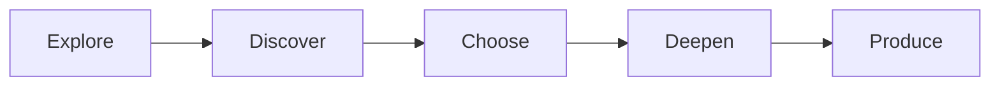

# Student Journey

  Students move through a Core developmental progression:
  Explore → Discover → Choose → Deepen → Produce.
  Exploration comes before strong specialisation. Undecided after meaningful exploration is acceptable.

::: tip Authority
Stage names are Constitution-level. Detailed stage architecture, typical windows, Exploration Floor, Discover exposure and Discover→Choose preparation are **APPROVED** Core decisions summarised here.
:::

## Developmental stages

| Stage | Intent (high level) |
|---|---|
| **Explore** | Broad foundational learning and guided making/investigation; Worlds used mainly as adult design tools, not permanent child labels |
| **Discover** | Meaningful experience across all Six Worlds so strengths and interests can surface through work — not career-day superficiality |
| **Choose** | Provisional concentration — direction without irreversible lock-in; guided preparation after Discover; undecided and cross-World interests allowed |
| **Deepen** | Formal Major + Minor pathway depth (entry at Deepen; Exploration Floor continues) |
| **Produce** | Advanced authentic contribution and production — not compulsory entrepreneurship |

## Stage is not capability depth

A learner’s place in the journey (Explore → Produce) is **not** the same as how deep they have gone in a particular World or capability.

Someone in Choose may already work at advanced depth in one domain. Someone in Deepen may still be building foundations in another. Capability depth uses a separate ladder described under [Six Worlds](/six-worlds).

## Discover → Choose

After meaningful Six Worlds exposure, transition into Choose is a **guided developmental transition**, not a career pass/fail gate. Learners may remain undecided, hold cross-World interests, or begin provisional concentration. Interest is not the same as capability; exposure is not the same as pathway readiness. AI may organise evidence but must not assign pathways. Family preference informs; it does not alone determine direction.

## What this page does not claim

- Malaysian Year mappings for each stage (country profile work)
- Fixed durations or timetable percentages for stages
- A settled Major/Minor subject catalogue
- Automated pathway assignment (pathway decisions require human judgment and student participation)
- Compulsory commercialisation at Produce

Typical developmental windows and readiness rules are APPROVED in [ADR-0005](/decisions/adr-0005) (approximate + readiness, not birthday gates). Learning-time **architecture** is APPROVED in [ADR-0019](/decisions/adr-0019); campus clocks remain deferred ([GAP-048](/gaps#gap-048)).

## Related architecture

| Artefact | Status |
|---|---|
| Concept Constitution — progression principle | APPROVED |
| [ADR-0004](/decisions/adr-0004) — student development / progressive specialisation | APPROVED |
| [ADR-0005](/decisions/adr-0005) — stage boundaries / Major-Minor entry | APPROVED |
| [ADR-0006](/decisions/adr-0006) — transition, Exploration Floor, mobility | APPROVED |
| [ADR-0017](/decisions/adr-0017) — Discover meaningful exposure package | APPROVED |
| [ADR-0018](/decisions/adr-0018) — Discover→Choose pathway preparation | APPROVED |
| [ADR-0019](/decisions/adr-0019) — learning-time architecture | APPROVED |

Blueprint area landing: [Student Journey (architecture)](/areas/student-journey)
