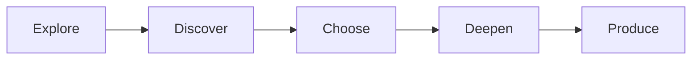

# Student Journey

  Students move through a working developmental progression:
  Explore → Discover → Choose → Deepen → Produce.
  Exploration comes before strong specialisation.

::: tip Authority
Stage names are approved at Constitution level. Detailed stage architecture, typical windows and Major/Minor entry rules are under review and are summarised carefully here — not as final approval.
:::

## Developmental stages

| Stage | Intent (high level) |
|---|---|
| **Explore** | Broad foundational learning and guided exposure; Worlds used mainly as adult design tools, not permanent child labels |
| **Discover** | Meaningful experience across domains so strengths and interests can surface through work, not career-day superficiality |
| **Choose** | Provisional concentration — direction without irreversible lock-in |
| **Deepen** | Formal Major + Minor pathway depth (architecture under review for entry timing) |
| **Produce** | Advanced authentic contribution and production |

## Stage is not capability depth

A learner’s place in the journey (Explore → Produce) is **not** the same as how deep they have gone in a particular World or capability.

Someone in Choose may already work at advanced depth in one domain. Someone in Deepen may still be building foundations in another. Capability depth uses a separate ladder described under [Six Worlds](/six-worlds).

## What this page does not claim

- Exact ages or year mappings for each stage
- Fixed durations for stages
- A settled Major/Minor catalogue
- Automated pathway assignment (pathway decisions require human judgment and student participation)

Age bands, operational readiness packages and timetable proportions remain open research and design questions in the Blueprint.

## Related architecture

| Artefact | Status |
|---|---|
| Concept Constitution — progression principle | APPROVED |
| [ADR-0004](/decisions/adr-0004) — student development / progressive specialisation | UNDER REVIEW |
| [ADR-0005](/decisions/adr-0005) — stage boundaries / Major-Minor entry | UNDER REVIEW |
| [ADR-0006](/decisions/adr-0006) — transition, exploration floor, mobility | UNDER REVIEW |

Blueprint area landing: [Student Journey (architecture)](/areas/student-journey)
